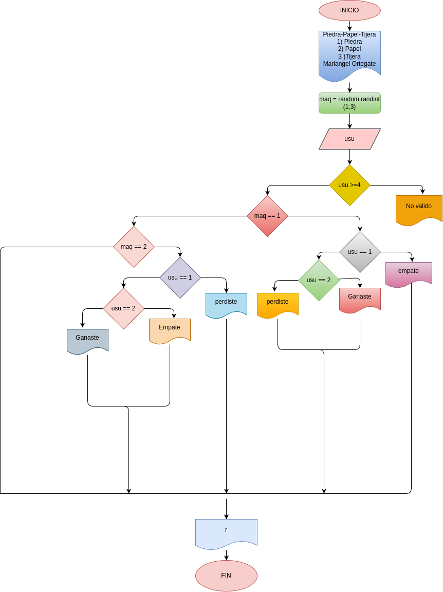

# Piedra_Papel_Tijera
Programa para un juego clásico (piedra-papel-tijera)

# Analisis

## Input

### Variables de entrada 
usu : eleccion realizada por el usuario

### Processing
usu: Determina la desicion del usuario 
Operaciones disponibles:
1. Piedra
2. Papel
3. tijeras
Si usu no es válido, el resultado será "No valido".

### output
usu: Determina la desicion del usuario
maq: Determina la desición de la maquina.

# Diseño

# Construcción

